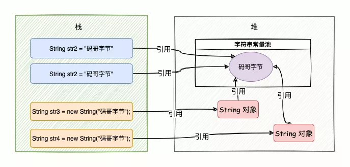

# String

### 结构：
```java
public final class String 
	implements java.io.Serializable, Comparable<String>, CharSequence {
	private final char[] value;
	private int hash;
}
```



### 不可变对象
使用final修饰类：不可被继承
使用private final修饰char[]：String对象不可被更改

final修饰的好处：
- 安全性：一些系统级操作指令会用到String
- 高性能缓存
- 实现字符串常量池（节约内存）


### 创建String对象的两种方法：

- 通过字面量创建：String str1 = "Hello";
  - Hello存储于字符串常量池中
- 通过new对象创建：String str2 = new String("Hello");
  -  Hello存储于字符串常量池中，引用地址存储于堆内存中


正则表达式使用的引擎：NFA（Non deterministic Finite Automation，确定型有穷自动机）
问题：进行字符串匹配时会发生回溯