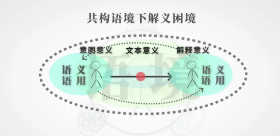
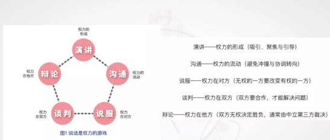
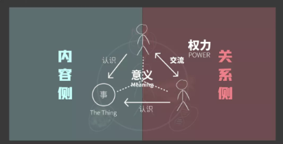

<h1> 关于说话的一切</h1>

### By @ 汤质看本质

?>   说话既是人最基本的生存活动，又是世间最难精通的信息游戏。说话本质上，是使语言符号产生意义的行为。

## 好好说话

>   我们的表达行为中包括着两种根本不同的符号活动，一种是**给予（gives）**的表达，一种是**流露（give off）**的表达。
>
>   ------   欧文·戈夫曼《日常生活中的自我呈现》

-   给予是主动的，流露是被动的
-   给予是容易操纵的，流露是不容易控制的
-   **接收者永远处于优势地位**，在两种符号活动中，发送者把更多的注意力放在前者身上，而接收者则同时注意两者，甚至天然地更关注后者。

!> 内向者，敏感于复自身与他人关系内在的复杂性

### 语境-语用-语义

**「根据语用推断语义，根据语境臆测语用」**

思考对方是在何种处境下，基于何种假设/信念产生的这些目的和用意，从而说出这些话？

### 说话是权利的游戏

**说话是使语言符号产生意义的活动，但一句言语到底有什么意义，取决于谁拥有“最终解释权”**

## 一句话到底是如何说进心坎里的

### 发送者、接收者

-   发送者通过组织语言符号来传达意义
-   接受者将意义解释出来
-   第三维度：事（一切他们之外的、可以被双方共同当做对象认识的东西）
-   事的意义最终取决于最终解释“权”    

 

语言活动的两个维度：「人与人」权力关系维度，「人与事」内容维度。

#### 三角测量法

评价是一种精神世界的“三角测量法”（the triangulation mode），本质是通过语言，把我和你之外的某个对象设定为参照物，以此为参照，来确定各自的位置和立场，以此来明确我们的相对关系。

>   语言一共三个功能，评价、告知和请求。   —— Tomasello (2008)

### 结构、张力、预期

尊重：社会动物的一种承认对方权利存在的姿态

!> **打破预期，顺应张力：即打破了特定权力结构下的交往预期，又要顺应了特定权力结构制造的欲望张力**

【权力结构】：所有的交往场景背后都有特定的权力结构，在微观个体层面，我们可以将其分成三类：

a）优势权力场景

b）弱势权力场景

c）平等权力场景

【欲望张力】：主体想要实现自身主体认同的一种心理驱力。

【交往预期】：指的是交往双方基于对权力关系、与欲望张力和觉察，对即将发生的交往活动持有的**预判、期许和成见。**

-   优势权利场景
    -   不对称的权力结构中，弱势者也依然有实现主体自觉的欲望
-   弱势权利场景
    -   强势方所持的交往预期：接收来自弱势方的吹捧话语，刺激主体以同样虚伪的谦辞来回应
    -   权力者希望他拥有的权力被其他对象真诚地、具体地、准确地「看见」，并「说出」
    -   **「所有人都认为你A成就了不起，其实你真正让人佩服的地方在B。」**这是面向权力者的黄金赞美句式。前半句破坏了原有预期，后半句释放了被抑制的欲望张力。

​                                                                                                                                                                                                                                                                                             

