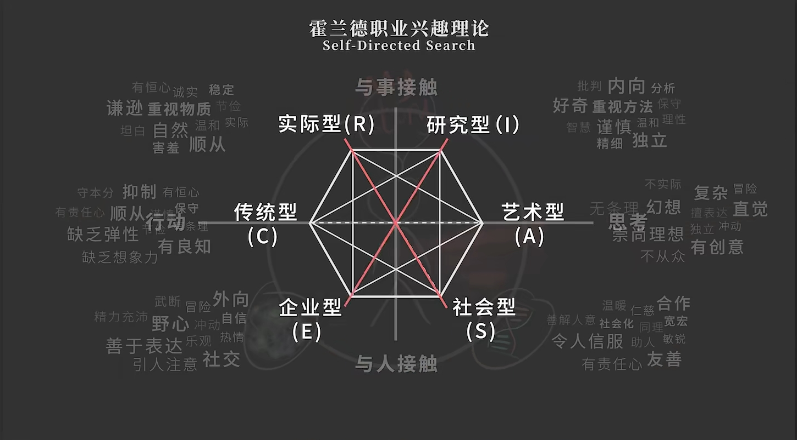

- 以时间换空间的人

	职业：**通过解决他人问题来解决自己问题**的一种生存模式

	空间换时间：能将自己和他人的时间封装物化，然后交换他人更多时间
	
	时间换空间：（消费者/打工人）拿时间换取物品的人
	
- 以时间换时间的人

	**自成目的性**的活动：这种活动本身而言是无代价的，因为这种活动本身就是该活动的成就。于是幸福的行为就是广义上的创造性行为，或者说是具有给予性的行为。即使这种行为在功利意义上得不到报偿，但它也已经以其本身昌盛出了生活的意义。

- 擅长与热爱

	行动偏好：行动/思考
	对象偏好：与人接触/与事接触
	
- 恐慌与胜任

- 时间问题

	限制想象力的：因为贫穷产生的对财富不加反思的欲求

