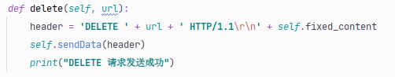

### <font size=3pt face="MV Boli" color="gray">By Ruicheng Zhang</font>

# 一、项目背景

## 1.1 Socket

Socket(套接字)可以看成是两个网络应用程序进行通信时，各自通信连接中的端点。通信时其中一个网络应用程序将要传输的一段信息写入它所在主机的 Socket中，该 Socket通过与网络接口卡(NIC)相连的传输介质将这段信息送到另外一台主机的 Socket中，使对方能够接收到这段信息。 

Socket=（IP地址：端口号）

要通过互联网进行通信，至少需要一对套接字，其中一个运行于客户端，我们称之为 Client Socket，另一个运行于服务器端，我们称之为 Server Socket 。

根据连接启动的方式以及本地套接字要连接的目标，套接字之间的连接过程可以分为三个步骤 ：

(1)服务器监听。

(2)客户端请求。

(3)连接确认。

## 1.2 HTTP

超文本传输协议（Hypertext Transfer Protocol，HTTP）是一个简单的请求-响应协议，它通常运行在TCP之上。它指定了客户端可能发送给服务器什么样的消息以及得到什么样的响应。请求和响应消息的头以ASCII形式给出。

HTTP协议规定的几个主要方法是get()、post()、delete()、put()、options()、connect()和trace()。它们的具体作用如下：

| 方法    | 描述                                     | 完成情况        |
| ------- | ------------------------------------- | --------------- |
| GET     | 请求指定的页面信息，并返回实体主体                           | √        |
| HEAD    | 类似于get请求，只不过返回的响应中没有具体的内容，用于获取报头 | √        |
| POST    | 向指定资源提交数据进行处理请求（例如提交表单或者上传文件）。数据被包含在请求体中。POST请求可能会导致新的资源的建立和/或已有资源的修改。 | √        |
| PUT     | 从客户端向服务器传送的数据取代指定的文档的内容。             | √        |
| DELETE  | 请求服务器删除指定的页面。                                   | √        |
| CONNECT | HTTP/1.1协议中预留给能够将连接改为管道方式的代理服务器。     | /        |
| OPTIONS | 允许客户端查看服务器的性能。                                 | √        |
| TRACE   | 回显服务器收到的请求，主要用于测试或诊断。                   | √        |

不同方法对应的的请求头和响应头格式见[附录一](# 六、附录一：HTTP请求与相应报文格式)。

HTTP的状态码分类如下：

| 分类 | 描述                                           |
| ---- | ---------------------------------------------- |
| 1**  | 信息，服务器收到请求，需要请求者继续执行操作   |
| 2**  | 成功，操作被成功接收并处理                     |
| 3**  | 重定向，需要进一步的操作以完成请求             |
| 4**  | 客户端错误，请求包含语法错误或无法完成请求     |
| 5**  | 服务器错误，服务器在处理请求的过程中发生了错误 |

其中常用的几个状态码含义如下：

| 状态码 | 名称                       | 描述                                                       | 完成情况 |
| ------ | -------------------------- | ---------------------------------------------------------- | -------- |
| 200    | OK                         | 请求成功。一般用于GET与POST请求                            | √        |
| 404    | Not Found                  | 服务器无法根据客户端的请求找到资源（网页）                 | √        |
| 500    | Internal Server Error      | 服务器内部错误，无法完成请求                               | /        |
| 502    | Bad Gateway                | 充当网关或代理的服务器，从远端服务器接收到了一个无效的请求 | /        |
| 505    | HTTP Version not supported | 服务器不支持请求的HTTP协议的版本，无法完成处理             | √        |

## 1.3 通过Socket建立TCP连接

> tcp_socket = socket(AF_INET, SOCK_STREAM) 

以上语句创建了一个IPv4、TCP连接的套接字。其中AF_INET代表IPv4协议族，SOCK_STREAM 代表TCP连接（SOCK_DGRAM：UDP连接）。


# 二、设计思路

## 2.1 总体架构设计

HTTP分为服务器与浏览器，服务器可以为多个浏览器服务。在我们的项目中，分别完成了服务端与客户端，可以实现两者之间请求与响应的处理与通信。同时，也可以用现有的浏览器访问客户端，也可以使用我们写的客户端访问外网的服务器。


## 2.2 传输层（Socket）设计


## 2.3 应用层（HTTP协议）设计

### 2.3.1 服务器


### 2.3.2 客户端


# 三、代码实现

## 3.1 GET部分代码

【客户端】


【服务端】

1.  获取文件内容
2.  获取文件大小
3.  获取文件类型
4.  生成对应的GET响应报头
5.  将文件内容封装在请求中
6.  发送GET请求给服务器


## 3.2 POST部分代码

【客户端】

1.  客户端输入需发送的内容
2.  生成相应POST请求头
3.  将内容封装在请求中
4.  发送POST请求给服务器


【服务端】

1.  客户端读取实体主体的内容
2.  依照原先设定的功能对内容进行处理
3.  生成相应的POST响应
4.  将内容封装在请求中
5.  发送POST响应


## 3.3 PUT部分代码

【客户端】

1.  客户端打开update.txt
2.  读取文件内容
3.  生成相应PUT请求头
4.  将内容封装在请求中
5.  调用PUT方法发送给服务器，URI参数设定为‘/putDemo.html’，即将update.txt中的内容写入服务端的putDemo.html


【服务端】

1.  根据路径打开文件
2.  将内容写入文件中
3.  返回相应的PUT响应


## 3.4 DELETE部分代码

【客户端】



【服务端】

1.  通过操作系统删除文件
2.  返回相应的DELETE响应


## 3.5 其他功能

HEAD与GET相似；TRACE即服务器将收到的报文原样返回给客户端；OPTIONS即在响应头中添加一条Allow，内容为服务器可以处理的请求方法；

# 四、功能展示与测试

## 4.1 使用Client访问Server

###  GET

【客户端】


### POST

【客户端】


### PUT

【客户端】


【服务端】


### DELETE

【客户端】


【服务端】


### HEAD

【客户端】


### TRACE

【客户端】


### OPTION

【客户端】


## 4.2 使用Client访问Baidu服务器

【客户端】


### 	Request

```
GET /url_path HTTP/1.1
Host: 127.0.0.1:7890
Connection: keep-alive
Pragma: no-cache
Cache-Control: no-cache
Upgrade-Insecure-Requests: 1
User-Agent: Mozilla/5.0 (Windows NT 10.0; Win64; x64) AppleWebKit/537.36 (KHTML, like Gecko) Chrome/91.0.4472.106 Safari/537.36 Aoyou/InJWPEhVTFNdZVZ6NENlbhYKq1diODf7bAWVwXlb8kID03kbAN7rECHw
Accept:text/html,application/xhtml+xml,application/xml;q=0.9,image/avif,image/webp,image/apng,*/*;q=0.8,application/signed-exchange;v=b3;q=0.9
Accept-Encoding: gzip, deflate
Accept-Language: zh-CN,zh;q=0.9
```

### Response

```
HTTP/1.1 200 OK
Server: Apache-Coyote/1.1
Connection: keep-alive
Content-Length: 2854
Content-Type: text/html;charset=utf-8

file content
```

## HEAD()

### Request

```
HEAD /url_path HTTP/1.1
Host: 127.0.0.1:7890
Connection: keep-alive
Pragma: no-cache
Cache-Control: no-cache
Upgrade-Insecure-Requests: 1
User-Agent: Mozilla/5.0 (Windows NT 10.0; Win64; x64) AppleWebKit/537.36 (KHTML, like Gecko) Chrome/91.0.4472.106 Safari/537.36 Aoyou/InJWPEhVTFNdZVZ6NENlbhYKq1diODf7bAWVwXlb8kID03kbAN7rECHw
Accept:text/html,application/xhtml+xml,application/xml;q=0.9,image/avif,image/webp,image/apng,*/*;q=0.8,application/signed-exchange;v=b3;q=0.9
Accept-Encoding: gzip, deflate
Accept-Language: zh-CN,zh;q=0.9
```

### Response

```
HTTP/1.1 200 OK
Server: Apache-Coyote/1.1
Connection: keep-alive
Content-Length: 2854
Content-Type: text/html;charset=utf-8
```

## POST()

### Request

```
POST / HTTP/1.1
Host: 127.0.0.1:7890
Connection: keep-alive
Content-Length: 16
Cache-Control: max-age=0
Upgrade-Insecure-Requests: 1
Origin: http://127.0.0.1:7890
Content-Type: application/x-www-form-urlencoded
User-Agent: Mozilla/5.0 (Windows NT 10.0; Win64; x64) AppleWebKit/537.36 (KHTML, like Gecko) Chrome/91.0.4472.106 Safari/537.36 Aoyou/XyQ6akh8DSwoWHg0X3RpS-CZZMCmKiuIITtj8Yuaxc11kkfu25A7sm1m
Accept:text/html,application/xhtml+xml,application/xml;q=0.9,image/avif,image/webp,image/apng,*/*;q=0.8,application/signed-exchange;v=b3;q=0.9', 'Sec-Fetch-Site: same-origin
Referer: http://127.0.0.1:7890/
Accept-Encoding: gzip, deflate, br
Accept-Language: zh-CN,zh;q=0.9

content=abcdefg
```

### Response

```
HTTP/1.1 200 OK
Connection: keep-alive
Content-Length: 2854
Content-Type: text/html;charset=utf-8

file content
```

## PUT()

### Request

```
PUT /filepath HTTP/1.1
Host: 127.0.0.1:7890
Connection: keep-alive
Pragma: no-cache
Cache-Control: no-cache
Upgrade-Insecure-Requests: 1
User-Agent: Mozilla/5.0 (Windows NT 10.0; Win64; x64) AppleWebKit/537.36 (KHTML, like Gecko) Chrome/91.0.4472.106 Safari/537.36 Aoyou/InJWPEhVTFNdZVZ6NENlbhYKq1diODf7bAWVwXlb8kID03kbAN7rECHw
Accept:text/html,application/xhtml+xml,application/xml;q=0.9,image/avif,image/webp,image/apng,*/*;q=0.8,application/signed-exchange;v=b3;q=0.9
Accept-Encoding: gzip, deflate
Accept-Language: zh-CN,zh;q=0.9

CONTENT
```

### Response

```
HTTP/1.1 200 OK
Connection: keep-alive
Transfer-Encoding: chunked
```

## DELETE()

### Request

```
DELETE /filepath HTTP/1.1
Host: 127.0.0.1:7890
Connection: keep-alive
Pragma: no-cache
Cache-Control: no-cache
Upgrade-Insecure-Requests: 1
User-Agent: Mozilla/5.0 (Windows NT 10.0; Win64; x64) AppleWebKit/537.36 (KHTML, like Gecko) Chrome/91.0.4472.106 Safari/537.36 Aoyou/InJWPEhVTFNdZVZ6NENlbhYKq1diODf7bAWVwXlb8kID03kbAN7rECHw
Accept:text/html,application/xhtml+xml,application/xml;q=0.9,image/avif,image/webp,image/apng,*/*;q=0.8,application/signed-exchange;v=b3;q=0.9
Accept-Encoding: gzip, deflate
Accept-Language: zh-CN,zh;q=0.9
```

### Response

```
HTTP/1.1 200 OK
Connection: keep-alive
Transfer-Encoding: chunked
```

## OPTIONS()

### Request

```
OPTIONS / HTTP/1.1
Host: 127.0.0.1:7890
Connection: keep-alive
Pragma: no-cache
Cache-Control: no-cache
Upgrade-Insecure-Requests: 1
User-Agent: Mozilla/5.0 (Windows NT 10.0; Win64; x64) AppleWebKit/537.36 (KHTML, like Gecko) Chrome/91.0.4472.106 Safari/537.36 Aoyou/InJWPEhVTFNdZVZ6NENlbhYKq1diODf7bAWVwXlb8kID03kbAN7rECHw
Accept:text/html,application/xhtml+xml,application/xml;q=0.9,image/avif,image/webp,image/apng,*/*;q=0.8,application/signed-exchange;v=b3;q=0.9
Accept-Encoding: gzip, deflate
Accept-Language: zh-CN,zh;q=0.9
```

### Response

```
HTTP/1.1 200 OK
Connection: keep-alive
Allow: HEAD,GET,POST,PUT,DELETE,OPTIONS,TRACE
Transfer-Encoding: chunked
```

## TRACE()

### Request

```
TRACE / HTTP/1.1
Host: 127.0.0.1:7890
Connection: keep-alive
Pragma: no-cache
Cache-Control: no-cache
Upgrade-Insecure-Requests: 1
User-Agent: Mozilla/5.0 (Windows NT 10.0; Win64; x64) AppleWebKit/537.36 (KHTML, like Gecko) Chrome/91.0.4472.106 Safari/537.36 Aoyou/InJWPEhVTFNdZVZ6NENlbhYKq1diODf7bAWVwXlb8kID03kbAN7rECHw
Accept:text/html,application/xhtml+xml,application/xml;q=0.9,image/avif,image/webp,image/apng,*/*;q=0.8,application/signed-exchange;v=b3;q=0.9
Accept-Encoding: gzip, deflate
Accept-Language: zh-CN,zh;q=0.9
```

### Response

```
TRACE / HTTP/1.1
Host: 127.0.0.1:7890
Connection: keep-alive
Pragma: no-cache
Cache-Control: no-cache
Upgrade-Insecure-Requests: 1
User-Agent: Mozilla/5.0 (Windows NT 10.0; Win64; x64) AppleWebKit/537.36 (KHTML, like Gecko) Chrome/91.0.4472.106 Safari/537.36 Aoyou/InJWPEhVTFNdZVZ6NENlbhYKq1diODf7bAWVwXlb8kID03kbAN7rECHw
Accept:text/html,application/xhtml+xml,application/xml;q=0.9,image/avif,image/webp,image/apng,*/*;q=0.8,application/signed-exchange;v=b3;q=0.9
Accept-Encoding: gzip, deflate
Accept-Language: zh-CN,zh;q=0.9
```