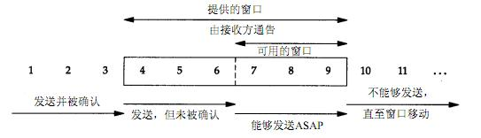

### By Ruicheng Zhang

# TCP和UDP

## TCP报文

## TCP的三次握手、四次挥手

### 三次握手

### 四次挥手

### 客户端TIME_WAIT状态：

第四次挥手时，客户端发送给服务器的ACK有可能丢失，TIME_WAIT状态就是用来重发可能丢失的ACK报文。如果Server没有收到ACK，就会重发FIN，如果Client在2*MSL的时间内收到了FIN，就会重新发送ACK并再次等待2MSL，防止Server没有收到ACK而不断重发FIN。

MSL(Maximum Segment Lifetime)，指一个片段在网络中最大的存活时间，2MSL就是一个发送和一个回复所需的最大时间。如果直到2MSL，Client都没有再次收到FIN，那么Client推断ACK已经被成功接收，则结束TCP连接。

## TCP的流量控制

滑动窗口：防止发送方发送速率太快，接收方缓存区不够导致溢出。

发送方窗口大小 = min(接收方的接收能力, 网络的传送能力)

## TCP的拥塞控制

-   慢启动
    -   设置一个最大报文段MSS，每经过一个传输轮次，拥塞窗口的大小就会加倍

-   拥塞避免
    -   拥塞窗口的大小达到慢开始门限时，开始执行拥塞避免算法：线性增加，每经过一个传输轮次只增加1MSS
    -   目的：快速准确地探测网络的拥塞状态，一开始快速收敛，到达阈值后防止超过导致拥塞且探测不准确，开始慢慢增长

-   快重传
    -   接收方在收到一个失序的报文段后就立即发出重复确认
    -   发送方只要一连收到三个重复确认就立即重传对方尚未收到的报文段

-   快恢复
    -   慢开始门限减半执行拥塞避免算法

## TCP和UDP的区别

1. TCP是面向连接的，UDP是无连接的；UDP发送数据之前不需要建立连接

2. TCP是可靠的，UDP不可靠；UDP接收方收到报文后，不需要给出任何确认

3. TCP只支持点对点通信，UDP支持一对一、一对多、多对一、多对多；
4. TCP是面向字节流的，UDP是面向报文的；面向字节流是指发送数据时以字节为单位，一个数据包可以拆分成若干组进行发送，而UDP一个报文只能一次发完。

5. TCP有拥塞控制机制，UDP没有。网络出现的拥塞不会使源主机的发送速率降低，这对某些实时应用是很重要的，比如媒体通信，游戏；
6. TCP首部开销（20字节）比UDP首部开销（8字节）要大
7. UDP 的主机不需要维持复杂的连接状态表

# HTTP

-   长连接

    从HTTP/1.1开始，默认长连接，使用Connection: Keep-Alive断开连接；

    在HTTP/1.1之前，默认短连接，长连接使用Connection: Keep-Alive；

-   HTTP/2：基于SPDY协议

    -   采用二进制格式
    -   多路复用、并行非阻塞
    -   报头压缩、降低开销
    -   服务器主动推送响应到客户端缓存中

-   多路复用

    

# FTP

# WebSocket

-   全双工通信
-   实时性更高（新消息产生时不需重新建立连接）

